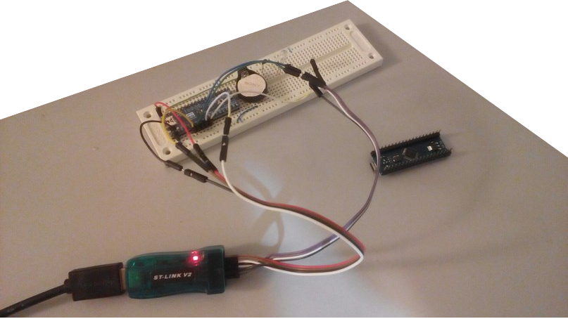

D baremetal "Hello, World!" on Cortex-M3.
=====

*Repeats Michael V. Franklin work "D Runtime ARM Cortex-M study" for Cortex-M3*
* https://github.com/JinShil/D_Runtime_ARM_Cortex-M_study
* http://wiki.dlang.org/Minimal_semihosted_ARM_Cortex-M_%22Hello_World%22

I am used cheapest hardware:

* [Cheap STM32 Cortex-M3 board LeafLabs Maple Mini (replica?)](http://www.ebay.com/itm/141404280807) (need soldering!) - AU $5.52
* [ST-Link V2 JTAG SWD adaptor (replica)](http://www.aliexpress.com/snapshot/6796984210.html?orderId=68316685665367) - $3
* Breadboard (this is optional because LeafLabs Maple Mini pins allows connection to adaptor directly)
* and some wires from local store



LeafLabs Maple Mini has a USB connection port and bootloader installed, but it isn't used because it's need to test full build chain with JTAG connection.

####Code

* start.d: code is slightly modified because some changes was occured in LDC libraries.
* stm32f103.ld: memory mapping slightly changed for support Maple's STM32F103RCBT6 MCU

####Software requirements

On Debian GNU/Linux it is need to install packages:

* ldc - compiler
* binutils-arm-none-eabi - linker
* openocd - JTAG software
* gdb-arm-none-eabi - debugger (also allows to load and run software on chip)

####Building
```
$ ldc2 -march=thumb -mcpu=cortex-m3 -c -g start.d #compilation
$ arm-none-eabi-ld -T stm32f103.ld --gc-sections start.o -o start.elf #linking
```

#### Loading and run

Starting openocd. Port 5449 is used because default openocd tcp port 4444 is busy on my system.
Relative paths like "target/stm32f1x.cfg" will be automatically resolved by openocd from /usr/share/openocd/scripts/

```
$ openocd -c "telnet_port 5449" -f interface/stlink-v2.cfg -f target/stm32f1x.cfg -c "transport select hla_swd"
Open On-Chip Debugger 0.9.0 (2015-05-28-17:08)
Licensed under GNU GPL v2
For bug reports, read
	http://openocd.org/doc/doxygen/bugs.html
Info : auto-selecting first available session transport "hla_swd". To override use 'transport select <transport>'.
Info : The selected transport took over low-level target control. The results might differ compared to plain JTAG/SWD
adapter speed: 1000 kHz
adapter_nsrst_delay: 100
none separate
Warn : Transport "hla_swd" was already selected
hla_swd
Info : Unable to match requested speed 1000 kHz, using 950 kHz
Info : Unable to match requested speed 1000 kHz, using 950 kHz
Info : clock speed 950 kHz
Info : STLINK v2 JTAG v17 API v2 SWIM v4 VID 0x0483 PID 0x3748
Info : using stlink api v2
Info : Target voltage: 3.548515
Info : stm32f1x.cpu: hardware has 6 breakpoints, 4 watchpoints
```

Starting gdb and connecting to openocd debugging socket
```
$ arm-none-eabi-gdb --init-eval-command="target remote localhost:3333" start.elf
GNU gdb (7.7.1+dfsg-1+6) 7.7.1
Copyright (C) 2014 Free Software Foundation, Inc.
License GPLv3+: GNU GPL version 3 or later <http://gnu.org/licenses/gpl.html>
This is free software: you are free to change and redistribute it.
There is NO WARRANTY, to the extent permitted by law.  Type "show copying"
and "show warranty" for details.
This GDB was configured as "--host=x86_64-linux-gnu --target=arm-none-eabi".
Type "show configuration" for configuration details.
For bug reporting instructions, please see:
<http://www.gnu.org/software/gdb/bugs/>.
Find the GDB manual and other documentation resources online at:
<http://www.gnu.org/software/gdb/documentation/>.
For help, type "help".
Type "apropos word" to search for commands related to "word"...
Remote debugging using localhost:3333
0x00000000 in ?? ()
Reading symbols from start.elf...done.
(gdb) 
```

Enabling semihosting and loading code into MCU by performing this commands:
```
monitor arm semihosting enable
monitor reset halt
load
monitor reset init
```
```
(gdb) monitor arm semihosting enable
semihosting is enabled
(gdb) monitor reset halt
target state: halted
target halted due to debug-request, current mode: Thread 
xPSR: 0x01000000 pc: 0x08000008 msp: 0x20005000, semihosting
(gdb) load
Loading section .text, size 0x8c lma 0x8000000
Start address 0x8000000, load size 140
Transfer rate: 229 bytes/sec, 140 bytes/write.
(gdb) monitor reset init
target state: halted
target halted due to debug-request, current mode: Thread 
xPSR: 0x01000000 pc: 0x08000008 msp: 0x20005000, semihosting
```

Then "continue" command will starts MCU to perform example:

```
(gdb) continue
Continuing.
^C
Program received signal SIGINT, Interrupt.
0x0800006c in start.SemihostingInvoke() (command=5, message=0x20004fe4) at start.d:15
15	    __asm
(gdb)
```

...and openocd terminal will prints "Hello, World!" message:
```
[...]
target halted due to debug-request, current mode: Thread 
xPSR: 0x01000000 pc: 0x08000008 msp: 0x20005000, semihosting
Hello, World!
Hello, World!
Hello, World!
Hello, World!
Hello, World!
Hello, World!
Hello, World!
Hello, World!
Hello, World!
Hello, World!
Hello, World!
Hello, World!
Hello, World!
Hello, World!
```
